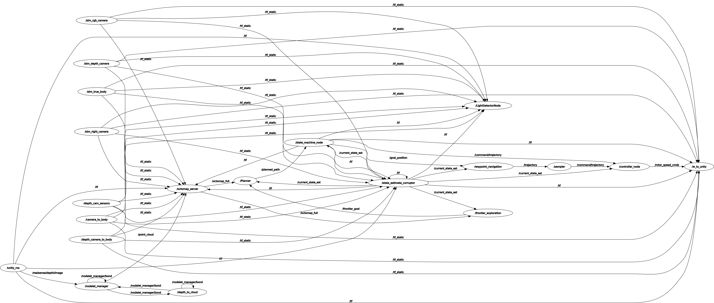
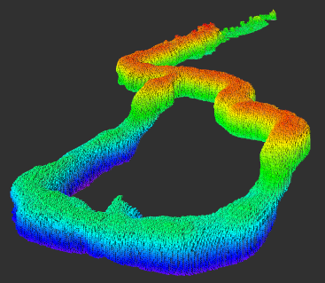

# TUM AAS - Autonomous Systems - 2023 Group Project: Sub-Terrain Challange

### Group 4
- Cem Kücükgenc     (cem.kucukgenc@tum.de)
    - Navigation (Path Planning, Trajectory Generation), Vision (Point Cloud Generation, Octomapping), DevOps 

- Baran Özer        (baran.oezer@tum.de)
    - State Machine, Navigation (Path Planning, Trajectory Generation), Vision (Point Cloud Generation, Octomapping) 

- Serdar Soyer      (serdar.soyer@tum.de)
    - Vision (Octomapping, Light Detection), Navigation (Frontier Exploration)

- Erencan Aslakci   (ge97jed@mytum.de)
    - Vision (Light Detection), Navigation (Frontier Exploration)

- Hünkar Suci       (hunkar.suci@tum.de)
    - Navigation (Path Planning, Frontier Exploration), Vision (Light Detection)

### Table of contents
1. [Introduction](#introduction)
    1. [Utilized libraries and external repositories](#utilized_libraries)
    2. [Generated packages](#generated_packages)
    3. [ROS graph, nodes and topic list](#ros_graph_nodes_topics)
2. [Installation guide](#installation_guide)
    1. [System setup](#system_setup)
    2. [Installing dependencies](#installing_dependencies)
    3. [Building project](#building_project)
3. [Launching the simulation](#launching_the_simulation)

## 1. Introduction <a name="introduction"></a>

This repository introduces ROS packages for autonomous exploration with a drone in a Unity cave environment. The drone utilizes its depth camera to generate the point cloud of its environment, then transforms this information into a 3D Voxel Grid representation by means of `OctoMap` library. Then it leverages a frontier detection and selection algorithm to detect frontiers (unexplored areas) using this Voxel grid representation. Subsequently, `RRT*` path planning algorithm plans the paths through these frontiers. The planned paths are transformed into executable trajectories by the `mav_trajectory_generation` package from ETH Zurich's Autonomous Systems Lab which enables the drone to autonomously navigate and explore 3D spaces efficiently. During its mission, the drone detects 4 objects of interest (lanterns) using its semantic camera and gives the location of them.

### 1.1. Utilized libraries and external repositories <a name="utilized_libraries"></a>
- `MAV Trajectory Generation` (https://github.com/ethz-asl/mav_trajectory_generation)
    - For trajectory generation

- `Depth Image Proc` (https://wiki.ros.org/depth_image_proc)
    - For depth image to point cloud conversion.

- `OctoMap` (https://github.com/OctoMap/octomap)
    - For 3D mapping in the environment

- `Open Motion Planning Library (OMPL)` (https://github.com/ompl/ompl)
    - For motion and mission planning

- `Flexible Cloud Library (FCL)` (https://github.com/flexible-collision-library/fcl)
    - For access and store data in the cloud

- `Point Cloud Library (PCL)` (https://github.com/PointCloudLibrary/pcl)
    - For point cloud to voxel grid conversion

- `OctomapPlanner` (https://github.com/ArduPilot/OctomapPlanner)
    - `Planner.cpp` and `Planner.h` is implemented as a base for path planning
    
- `Pcl-Optics` (https://github.com/Nandite/Pcl-Optics/tree/master)
    - `Optics.hpp` is for finding density-based clusters in spatial data


### 1.2. Generated packages <a name="generated_packages"></a>
- `state_machine_pkg` 
    - Handling the drone's state transitions based on its position and mission progress. It utilizes topics for communication, timers for periodic tasks, and state management.

- `navigation_pkg` 
    - Being enable to autonomously navigation in the environment by using path planning algorithms. RRT* is used to calculate optimal paths from the drone's current position to a target location. 

- `vision_pkg` 
    - Detection and tracking features of objects within the environment by integrating semantic and depth data, transforming this in the global reference frame.

### 1.3. ROS graph, nodes and topic list <a name="ros_graph_nodes_topics"></a>

#### ROS graph (`rqt_graph`)



#### Generated ROS Nodes  
- `/frontier_exploration`
    - The primary goal of the Frontier Exploration node is to enable autonomous exploration of unknown environments by systematically identifying and navigating towards unexplored areas.
- `/Planner`
    - By combining path planning with real-time collision avoidance and adaptive goal setting, it enables drones or robotic systems to navigate safely and efficiently, whether for exploration, mapping, or specific mission objectives.
- `/state_machine_node`
    - The state machine node manages the drone's flight states and goals, starting with takeoff from an initial position, then flying to predefined coordinates such as a lamp position and a cave entrance.
- `/waypoint_navigation`
    - The waypoint navigation node orchestrates the movement of the drone from one waypoint to another, ensuring it follows the designated path accurately and safely.
- `/sampler`
    - The sampler subscribes to planned trajectory segments, converts them into a format suitable for UAV control
- `/nodelet_manager`
    - Nodelets are a ROS feature designed to optimize the computational efficiency of processing data by running multiple nodes in a single process.
- `/depth_to_cloud`
    - The depth to cloud node is that transforms depth image data from a depth camera into a 3D point cloud format.
- `/octomap_server`
    - The octomap server node updates its internal octree representation of the environment by marking the spaces where obstacles are detected as occupied and spaces.
- `/LightDetectorNode`
    - This ROS node operates as a light detection system, utilizing input from semantic and depth camera images to identify light sources in the environment.

#### Given ROS Nodes by Template:
- `/controller_node`
    - The Controller node is designed to control a quadrotor UAV by implementing a geometric tracking controller.
- `/unity_ros`
    - Serving an interface between ROS and the Unity engine.
- `/state_estimate_corruptor`
    - The State estimate corruptor Node is for simulation and testing purposes, specifically to introduce errors or noise into the drone's state estimates.
- `/sim_true_body`
    - Providing ground truth data that the node simulates and publishes the drone's true position, orientation (pitch, roll, yaw) 
- `/sim_depth_camera`
    - The Sim Depth Camera node associated with interfacing and processing data from a depth camera attached to the drone, focusing a lightweight approach.
- `/sim_rgb_camera`
    - Associated an interface with an RGB camera on the drone, focusing on capturing and processing color images.
- `/sim_right_camera`
    - Handling the data stream from a camera mounted on the right side of the drone.
- `/camera_to_body`
    - For transforming camera data from the camera's coordinate frame to the drone's body frame of reference.
- `/depth_camera_to_body`
    - The node serves the purpose of transforming depth camera data to the drone's body frame of reference.
- `/depth_cam_sensors`
    - Handling interfacing with and processing data from a depth camera mounted on the drone.
- `/w_to_unity`
    - The node takes data from ROS topics, such as sensor data, state estimates, or navigation paths, and converts it into a format that Unity can understand.

#### ROS Topic List

- `/clicked_point`
- `/command/trajectory`
- `/current_state_est`
- `/detected_points`
- `/free_cells_vis_array`
- `/frontier_goal`
- `/goal_position`
- `/initialpose`
- `/move_base_simple/goal`
- `/nodelet_manager/bond`
- `/occupied_cells_vis_array`
- `/octomap_binary`
- `/octomap_full`
- `/octomap_point_cloud_centers`
- `/octomap_server/parameter_descriptions`
- `/octomap_server/parameter_updates`
- `/path_segments`
- `/planned_path`
- `/point_cloud`
- `/pose_est`
- `/projected_map`
- `/realsense/depth/camera_info`
- `/realsense/depth/image`
- `/realsense/rgb/left_image_info`
- `/realsense/rgb/left_image_raw`
- `/realsense/rgb/right_image_info`
- `/realsense/rgb/right_image_raw`
- `/realsense/semantic/camera_info`
- `/realsense/semantic/image_raw`
- `/rosout`
- `/rosout_agg`
- `/rotor_speed_cmds`
- `/tf`
- `/tf_static`
- `/trajectory`
- `/trajectory_markers`
- `/true_pose`
- `/true_twist`
- `/twist_est`
- `/unity_ros/Quadrotor/Sensors/IMU`
- `/unity_ros/command_topic`
- `/w_to_unity/pose_topic`

## 2. Installation guide <a name="installation_guide"></a>

### 2.1. System setup <a name="system_setup"></a>
This project is developed for `Ubuntu 20.04` with `ROS Noetic`. Be sure your system has the same configuration. You can check the following links to install them:

 - `Ubuntu 20.04` setup guide link: https://releases.ubuntu.com/focal/ 
 - `ROS Noetic` setup guide link: https://wiki.ros.org/noetic/Installation/Ubuntu 

 It is required that the `ROS Noetic` should be sourced in each terminal to run the simulation as mentioned in the `ROS Noetic` setup guide link. To do that,
 ```
source /opt/ros/noetic/setup.bash
 ```
should be sourced in each terminal. To make it more easy, it can be added to the `.bashrc` file for automatic sourcing. Details can be found in the `ROS Noetic` setup guide link. Sourcing `ROS Noetic` will no longer be mentioned in further steps.

#### Bonus: Docker container setup for `Ubuntu 20.04` with `ROS Noetic` (Bypass this section and continue from "2.2. [Installing dependencies](#installing_dependencies)" if you have a successful installation of `Ubuntu 20.04` with `ROS Noetic`)

If you have a different Linux or ROS distro, you may prefer to use a Docker container to run the simulation. To do that, an example Docker container implementation for a PC with `Intel i7-1165G7` CPU (no Discreet GPU) and `Ubuntu 22.04` will be explained. In any case, you should try to implement it according to your system with external sources. This method is not guaranteed to work perfectly in your system.

Install the Docker by following the link

- https://docs.docker.com/desktop/install/ubuntu/

NOTE: `sudo` commands in front of `docker` are removed in the following scripts. If you have errors regarding to this, you may need to add the user to the `docker` group or add `sudo` in front of the `docker` commands in the scripts which are already there but commented out. To add the user to the `docker` group, you can check the following tutorial

- https://www.youtube.com/watch?v=VjUbSe8ONhs

Open a terminal (will be mentioned as T1) and create a directory preferably in the `home` location as
```
mkdir -p autsys_ws
cd autsys_ws
```
Clone the project repository (T1)
```
git clone git@github.com:cemkucukgenc/tum_autsys_project.git
```
On `docker/create_container.sh`, change line 4 to your `catkin_ws_path` and line 11 to your shared volume path.

On `docker/continue_container.sh`, change the line 4 as your `catkin_ws_path`.

Bonus: The `rosurce.sh` is created to source the `catkin_ws_path` easily. If you want to use that too; on `docker/rosurce.sh`, change line 3 to your `catkin_ws_path`.

Pull the corresponding Docker image (T1)
```
sudo docker pull osrf/ros:noetic-desktop-full
```

Create necessary Docker image `autsys_image` (T1)
```
cd tum_autsys_project/docker
sudo docker image build -t autsys_image .
```

Create the Docker container `autsys_container` (T1)
```
sudo chmod +x create_container.sh
sudo chmod +x continue_container.sh
./create_container.sh
```

Congrats! Your container is created and the shared volume is already including the project repository. Use this container to run the project.

Here are some useful commands that will be needed in the further steps of running the simulation. Docker container will no longer be explained, you should be able to set up, reach, or delete the containers by yourself with this information.

To reach the container on another terminal
```
cd autsys_ws/tum_autsys_project/docker
./continue_container.sh
```
or
```
sudo docker exec -it autsys_container bash
```

To list and delete the image
```
sudo docker images
sudo docker image rm autsys_image
```

To list and delete the container
```
sudo docker ps -a
sudo docker stop autsys_container
sudo docker rm autsys_container
```

Useful tutorials for your reference

- https://www.youtube.com/watch?v=qWuudNxFGOQ
- https://www.youtube.com/watch?v=oULAVsGlLe8&t

### 2.2. Installing dependencies <a name="installing_dependencies"></a>

To have a clear installation, updating and upgrading your system is recommended.
```
sudo apt-get update
sudo apt-get upgrade
```

For the installation of packages, basic tools are required. 
```
sudo apt install git wstool wget libtool apt-utils python3-catkin-tools
```

For the generation of the Point Cloud, `depth_image_proc` package has been utilized. 
```
sudo apt install ros-noetic-depth-image-proc
```

For the generation of the OctoMap, `octomap` and `octomap_mapping` packages have been utilized. 
```
sudo apt-get install ros-noetic-octomap ros-noetic-octomap-mapping
```

For the path planning, `Open Motion Planning Library (OMPL)` and `Flexible Cloud Library (FCL)` are required. 
```
sudo apt-get install ros-noetic-ompl ros-noetic-fcl
```

### 2.3. Building project <a name="building_project"></a>

Open a terminal (will be mentioned as T1) and create a directory preferably in the `home` location as
```
mkdir -p autsys_ws
cd autsys_ws
```
Clone the project repository (T1)
```
git clone git@github.com:cemkucukgenc/tum_autsys_project.git
```
From the following link, download the `Simulation.zip` file from the Challange folder. (Since the content is large in size, it is not added to git.)

- https://syncandshare.lrz.de/getlink/fiQNaj3tQpvatqB8A5gAHV/

Extract the contents and copy all of them into
```
autsys_ws/tum_autsys_project/catkin_ws/src/simulation
```
Make the `Simulation.x86_64` as executable (T1)
```
cd tum_autsys_project/catkin_ws/src/simulation
chmod +x Simulation.x86_64 
```
To build the project in `autsys_ws/tum_autsys_project/catkin_ws` (T1)
```
cd ../..
catkin build
```

## 3. Launching the simulation <a name="launching_the_simulation"></a>

To run the simulation (T1)
```
source /autsys_ws/tum_autsys_project/catkin_ws/devel/setup.bash
roslaunch simulation mission.launch
```
`mission.launch` file launches related packages that should be run simultaneously. Additionally, it runs `rviz` to show octomapping visual.

During the Frontier Exploration and Path Planning processes, we sometimes encounter a segmentation fault. We have examined the error logs and tried using smart pointers, but have not reached a solution. We were receiving this error even before patches were applied to the voids in the cave in the simulation. After the new simulation version with patching edit, we began to receive the error less frequently and reached further locations in the cave. However, some voids still exist. We therefore thought that the remaining voids might be the reason for this error.  Please note that, despite the segmentation fault, when the command is executed in a seperate terminal to restart the explorer, the drone continues its mission. To do that in a separate terminal (T2)
```
rosrun navigation_pkg frontier_exploration
```


